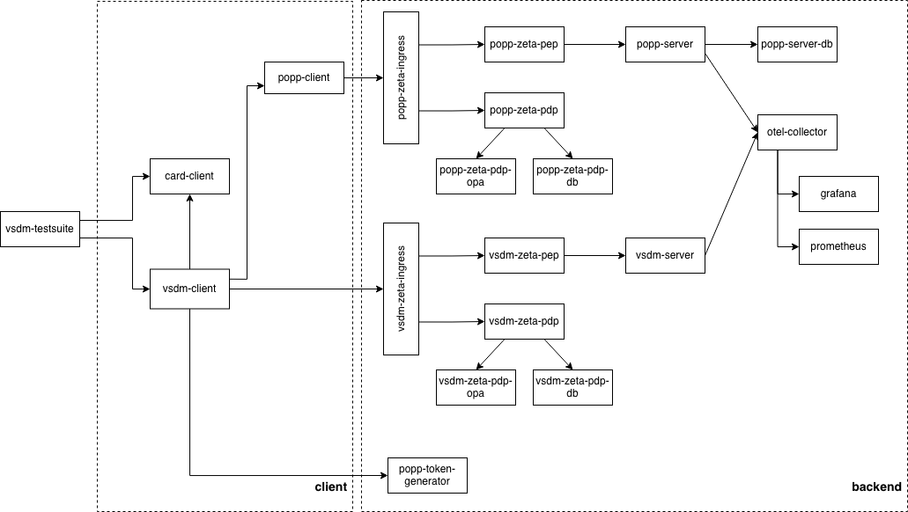
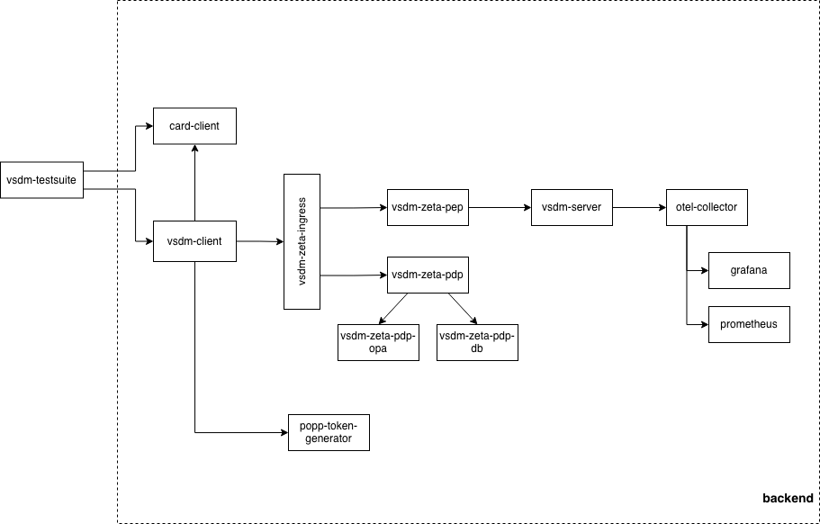

== Configuration

=== Port Configuration via `.env` File

All external ports exposed by the Docker containers are centrally configured in
`doc/docker/.env`. Docker Compose automatically loads this file when you run
commands from the `doc/docker/` directory (or pass `-f doc/docker/compose-local.yaml`).

.Default port assignments
[cols="2,1,3", options="header"]
|===
| Variable | Default | Service

| `PORT_CARD_TERMINAL_CLIENT` | `6200` | Card Terminal Client HTTP
| `PORT_CARD_TERMINAL_CLIENT_DEBUG` | `5005` | Card Terminal Client remote debugger
| `PORT_VSDM_CLIENT` | `6100` | VSDM Client HTTP
| `PORT_VSDM_CLIENT_DEBUG` | `5006` | VSDM Client remote debugger
| `PORT_TIGER_PROXY` | `6300` | Tiger Proxy HTTP
| `PORT_TIGER_PROXY_ADMIN` | `6350` | Tiger Proxy admin UI
| `PORT_TI_CONNECT_TIGER_PROXY` | `6400` | TI-Connect Tiger Proxy HTTP
| `PORT_TI_CONNECT_TIGER_PROXY_ADMIN` | `6450` | TI-Connect Tiger Proxy admin UI
| `PORT_OTEL_COLLECTOR` | `4318` | OpenTelemetry Collector
| `PORT_PROMETHEUS` | `7100` | Prometheus
| `PORT_GRAFANA` | `7001` | Grafana dashboard
| `PORT_POPP_TOKEN_GENERATOR` | `9500` | PoPP Token Generator HTTP
| `PORT_POPP_CLIENT` | `18081` | PoPP Client HTTP
| `PORT_POPP_CLIENT_MGMT` | `5013` | PoPP Client management
| `PORT_POPP_SERVER` | `18443` | PoPP Server HTTPS
| `PORT_POPP_SERVER_DB` | `15432` | PoPP Server PostgreSQL
| `PORT_POPP_ZETA_INGRESS` | `1443` | PoPP ZETA Ingress (nginx)
| `PORT_POPP_ZETA_PEP` | `2101` | PoPP ZETA PEP
| `PORT_POPP_ZETA_PDP` | `2201` | PoPP ZETA PDP (Keycloak)
| `PORT_POPP_ZETA_PDP_HEALTH` | `2202` | PoPP ZETA PDP health endpoint
| `PORT_POPP_ZETA_PDP_DEBUG` | `2203` | PoPP ZETA PDP remote debugger
| `PORT_POPP_ZETA_PDP_DB` | `2301` | PoPP ZETA PDP PostgreSQL
| `PORT_POPP_ZETA_PDP_OPA` | `2401` | PoPP ZETA OPA policy engine
| `PORT_VSDM_ZETA_INGRESS` | `9119` | VSDM ZETA Ingress (nginx)
| `PORT_VSDM_SERVER` | `9130` | VSDM Server HTTP
| `PORT_VSDM_SERVER_DEBUG` | `5012` | VSDM Server remote debugger
| `PORT_VSDM_ZETA_PEP` | `9120` | VSDM ZETA PEP
| `PORT_VSDM_ZETA_PDP` | `9122` | VSDM ZETA PDP (Keycloak)
| `PORT_VSDM_ZETA_PDP_HEALTH` | `9123` | VSDM ZETA PDP health endpoint
| `PORT_VSDM_ZETA_PDP_DEBUG` | `5022` | VSDM ZETA PDP remote debugger
| `PORT_VSDM_ZETA_PDP_OPA` | `8181` | VSDM ZETA OPA policy engine
|===

To remap a port that conflicts with another service on your machine, either edit
`doc/docker/.env` directly or pass the variable inline:

[source,bash]
----
# Remap VSDM server to port 19130 for this run only
PORT_VSDM_SERVER=19130 docker compose -f doc/docker/compose-local.yaml --profile full up -d

# Or export the variable in your shell session
export PORT_VSDM_SERVER=19130
docker compose -f doc/docker/compose-local.yaml --profile full up -d
----

The Spring Boot `application-local.yaml` files in the client services reference
the same port variables (e.g. `${PORT_VSDM_ZETA_PEP:9120}`), so the service
URLs used during local development automatically stay in sync with the Docker
setup. If you run a client service directly from IntelliJ or the command line,
you can load the variables from `.env` in one of two ways:

- **IntelliJ:** Open *Run → Edit Configurations*, switch to the **EnvFile** tab,
  click `+` and select `doc/docker/.env`. All port variables are then available
  to the Spring Boot process.
- **Shell:** Source the file before starting the application:
  ```bash
  export $(grep -v '^#' doc/docker/.env | xargs)
  ./mvnw spring-boot:run -pl client/vsdm-client-simservice-java -Dspring-boot.run.profiles=local
  ```

=== Environment Variables

Each service can be configured via environment variables. Key configuration options:

==== ZeTA PDP Services

- `AUTHZ_SEC_STORE_PATH` - Path to PKCS12 keystore file
- `AUTHZ_SEC_STORE_PASS` - Keystore password
- `AUTHZ_SEC_KEY_ALIAS` - Key alias in keystore
- `AUTHZ_SEC_KEY_PASS` - Private key password

==== Client Services

- `POPP_HTTP_URL` - PoPP service HTTP URL
- `VSDM_RESOURCE_SERVER_URL` - VSDM service HTTP URL

=== Docker Compose Profiles

The Testhub supports different startup profiles for various use cases:

[cols="1,3", options="header"]
|===
| Profile
| Description

| `full`
| Backend + Tiger-Proxies + Clients via proxy. Use this for normal development and testing.

| `perf`
| Backend + Tiger-Proxies + Clients with direct backend access. Use this for performance testing as it bypasses the Tiger-Proxy.

| `backend-only`
| Backend services only (no Tiger-Proxies, no clients). Use this when you want to run your own client implementation against the backend.
|===

==== The `full` Profile – Requests via Tiger Proxy

The `full` profile represents the standard development and testing setup.
All traffic between the clients (VSDM Client, Card Terminal Client) and the
backend services is routed through the **Tiger Proxy**, which records every
HTTP request and response for later analysis (see <<_traffic>>).
A second proxy instance – the **TI-Connect Tiger Proxy** – handles the
simulated TI-Connect path.

.Architecture of the `full` profile


Key characteristics of the `full` profile:

* The Tiger Proxy acts as a man-in-the-middle recorder – requests are visible
  in the Tiger UI and stored in the `.tgr` traffic files.
* All Tiger Proxy instances (frontend, backend, TI-Connect) are started.
* The OpenTelemetry Collector, Prometheus, and Grafana are included for
  observability.
* Suitable for functional feature-testing, debugging, and contract (Pact) verification.

==== The `perf` Profile – Direct Backend Access

The `perf` profile is optimised for **performance and load testing**.
Clients connect **directly** to the backend services, bypassing all Tiger Proxy
instances.  This eliminates the overhead of request recording and proxy
hop latency.

.Architecture of the `perf` profile


Key characteristics of the `perf` profile:

* No backend Tiger Proxy is started – traffic is *not* recorded.
* Lower latency and higher throughput than the `full` profile.
* Suitable for measuring baseline performance, stress tests, and benchmarks.

==== Comparison: `full` vs. `perf`

[cols="1,2,2", options="header"]
|===
| Aspect | `full` profile | `perf` profile

| Tiger Proxy
| ✅ Started – records all traffic
| ❌ Not started

| Popp Service
| ✅ Started – all components (Token Generator, Client, Server) are included
| ❌ Not started - only popp-token-generator is included for token generation

| Traffic recording
| ✅ `.tgr` and `.html` files written
| ❌ No recording

| Observability (OTEL / Prometheus / Grafana)
| ✅ Included
| ✅ Included

| Client routing
| Via Tiger Proxy (extra hop)
| Direct to backend

| Latency overhead
| Higher (proxy hop)
| Lower (direct)

| Recommended for
| Feature tests, debugging, Pact verification
| Performance tests, load tests, benchmarks
|===

==== Starting with Profiles

Use Docker Compose with the appropriate profile:

[source,bash]
----
# Build Docker images first
./mvnw clean install -Pdocker -DskipTests

# Start full stack
docker compose -f doc/docker/compose-local.yaml --profile full up -d


# Start with performance profile (clients bypass Tiger-Proxy)
docker compose -f doc/docker/compose-local.yaml --profile perf up -d

# Start backend only (no clients)
docker compose -f doc/docker/compose-local.yaml --profile backend-only up -d

# Stop all containers (all profiles)
docker compose -f doc/docker/compose-local.yaml --profile full --profile perf --profile backend-only down -v
----

=== Custom Configuration

To customize service configuration:

1.  Edit `doc/docker/compose-local.yaml` for Docker Compose setup
2. Or create custom `application-<profile>.yaml` files in each service's `src/main/resources` directory

